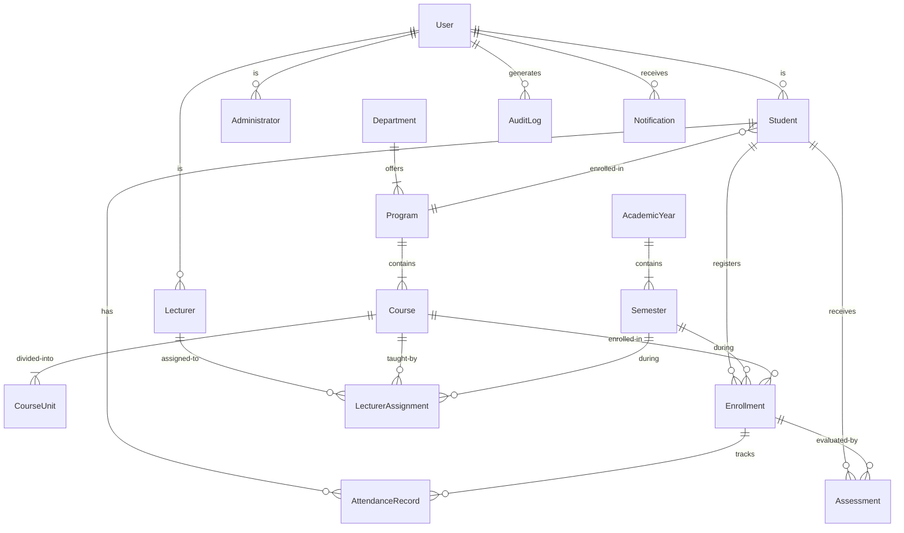

# Smart Campus Student Management System - Technical Design Document

## Overview

The Smart Campus Student Management and Academic Information System is a comprehensive enterprise-grade web application built using Java Spring Boot that centralizes academic administration processes. The system addresses critical inefficiencies in manual record-keeping by providing automated, secure, and role-based access to academic structures, course management, attendance tracking, assessment management, grade calculation, and transcript generation.

### System Goals

1. **Centralize Academic Data**: Provide a single source of truth for all academic information
2. **Automate Administrative Processes**: Reduce manual effort in attendance tracking, grade calculation, and report generation
3. **Enforce Security and Access Control**: Implement role-based authorization with comprehensive audit logging
4. **Ensure Data Integrity**: Maintain referential integrity and enforce business rules through validation
5. **Support Scalability**: Handle institutional growth with optimized queries and caching strategies
6. **Enable Reporting and Analytics**: Generate comprehensive reports for administrators and stakeholders

### Key Features

- **Role-Based Access Control**: Three distinct user roles (Administrator, Lecturer, Student) with specific permissions
- **Academic Structure Management**: Departments, programs, courses, and course units hierarchy
- **Student Lifecycle Management**: Registration, enrollment, course registration, and transcript generation
- **Attendance Tracking**: Real-time attendance recording with automated notifications
- **Assessment Management**: Coursework and examination marks with automatic grade calculation
- **GPA Calculation**: Semester and cumulative GPA computation following institutional policies
- **Reporting System**: Comprehensive reports on enrollment, performance, workload, and attendance
- **Audit Logging**: Complete activity tracking for security and compliance
- **Notification System**: Automated notifications for academic events and milestones
- **Data Export and Backup**: CSV/JSON export and database backup/restore functionality

### Technology Stack Justification

**Backend Framework: Spring Boot 3.x**
- Industry-standard framework for enterprise Java applications
- Built-in dependency injection and inversion of control
- Extensive ecosystem with Spring Security, Spring Data JPA, and Spring Boot Actuator
- Production-ready features including health checks, metrics, and externalized configuration
- Simplified configuration with auto-configuration and starter dependencies

**Database: MySQL/SQLite with JPA/Hibernate**
- MySQL for production: ACID compliance, proven scalability, strong community support
- SQLite for development/testing: Zero-configuration, lightweight, portable
- JPA/Hibernate: Database-agnostic ORM with lazy loading, caching, and transaction management
- Support for complex relationships and cascading operations

**Security: Spring Security**
- Comprehensive authentication and authorization framework
- Support for JWT-based stateless authentication
- Method-level security with annotations (@PreAuthorize, @Secured)
- Protection against common vulnerabilities (CSRF, XSS, SQL injection)
- Integration with password encoding (BCrypt) and session management

**Frontend: HTML/CSS/JavaScript with Bootstrap**
- Responsive design for multiple device types
- Bootstrap for consistent UI components and grid system
- Vanilla JavaScript with fetch API for RESTful communication
- Optional JavaFX for desktop version with offline capabilities

**Additional Technologies**
- **Maven**: Dependency management and build automation
- **Lombok**: Reduce boilerplate code with annotations
- **iText/Apache PDFBox**: PDF generation for transcripts and reports
- **Spring Boot Validation**: Bean validation with JSR-380 annotations
- **Spring Boot Actuator**: Production monitoring and health checks
- **Log4j2/SLF4J**: Structured logging with log levels and rotation

## Architecture

### System Architecture Overview

The system follows a **three-tier layered architecture** that separates concerns into distinct layers, promoting maintainability, testability, and scalability.

```
┌─────────────────────────────────────────────────────────────┐
│                    PRESENTATION LAYER                        │
│                                                              │
│  ┌──────────────┐  ┌──────────────┐  ┌──────────────┐     │
│  │   Web UI     │  │  REST API    │  │  JavaFX UI   │     │
│  │ (HTML/CSS/JS)│  │ Controllers  │  │  (Optional)  │     │
│  └──────────────┘  └──────────────┘  └──────────────┘     │
└─────────────────────────────────────────────────────────────┘
                            ▲
                            │ HTTP/REST
                            ▼
┌─────────────────────────────────────────────────────────────┐
│                   BUSINESS LOGIC LAYER                       │
│                                                              │
│  ┌──────────────────────────────────────────────────────┐  │
│  │              Service Components                       │  │
│  │  • Authentication Service  • Course Service          │  │
│  │  • Student Service         • Attendance Service      │  │
│  │  • Lecturer Service        • Assessment Service      │  │
│  │  • Grade Calculation Svc   • Notification Service    │  │
│  │  • Report Service          • Audit Service           │  │
│  └──────────────────────────────────────────────────────┘  │
│                                                              │
│  ┌──────────────────────────────────────────────────────┐  │
│  │           Cross-Cutting Concerns                      │  │
│  │  • Security (JWT/Session)  • Validation              │  │
│  │  • Transaction Management  • Exception Handling      │  │
│  │  • Caching                 • Logging                 │  │
│  └──────────────────────────────────────────────────────┘  │
└─────────────────────────────────────────────────────────────┘
                            ▲
                            │ JPA/Hibernate
                            ▼
┌─────────────────────────────────────────────────────────────┐
│                    DATA ACCESS LAYER                         │
│                                                              │
│  ┌──────────────────────────────────────────────────────┐  │
│  │           Repository Components (JPA)                 │  │
│  │  • UserRepository          • CourseRepository        │  │
│  │  • StudentRepository       • AttendanceRepository    │  │
│  │  • LecturerRepository      • AssessmentRepository    │  │
│  │  • EnrollmentRepository    • AuditLogRepository      │  │
│  └──────────────────────────────────────────────────────┘  │
└─────────────────────────────────────────────────────────────┘
                            ▲
                            │ JDBC
                            ▼
┌─────────────────────────────────────────────────────────────┐
│                      DATABASE LAYER                          │
│                   MySQL / SQLite                             │
└─────────────────────────────────────────────────────────────┘
```

### Architectural Layers

#### 1. Presentation Layer

**Responsibilities:**
- Receive user input and display responses
- Handle HTTP requests and routing
- Perform input validation and sanitization
- Transform domain objects to DTOs (Data Transfer Objects)
- Manage session state and authentication tokens

**Components:**
- **REST Controllers**: Expose RESTful endpoints for CRUD operations
- **View Templates**: HTML pages with Bootstrap for responsive UI
- **Static Resources**: CSS, JavaScript, images
- **Exception Handlers**: Global exception handling with @ControllerAdvice
- **Request/Response DTOs**: Data transfer objects for API contracts

**Design Patterns:**
- **MVC Pattern**: Separation of model, view, and controller concerns
- **DTO Pattern**: Decouple internal domain models from API contracts
- **Request Mapping**: Annotation-based routing with @RestController

#### 2. Business Logic Layer

**Responsibilities:**
- Implement business rules and domain logic
- Coordinate between repositories and controllers
- Manage transactions and data consistency
- Perform complex calculations (GPA, grades, attendance percentage)
- Trigger notifications and audit logging
- Apply security rules and authorization checks

**Components:**
- **Service Interfaces**: Define contracts for business operations
- **Service Implementations**: Implement business logic with @Service annotation
- **Domain Models**: Represent business entities with behavior
- **Business Validators**: Validate business rules beyond simple field validation
- **Event Publishers**: Publish domain events for notification system

**Design Patterns:**
- **Service Layer Pattern**: Encapsulate business logic in service classes
- **Transaction Script**: Organize business logic around procedures
- **Domain Model Pattern**: Rich domain objects with behavior
- **Strategy Pattern**: Different grade calculation strategies by institution
- **Observer Pattern**: Event-driven notifications using Spring Events

#### 3. Data Access Layer

**Responsibilities:**
- Abstract database operations using JPA repositories
- Execute queries and manage persistence context
- Handle database transactions
- Optimize queries with lazy/eager loading strategies
- Implement caching for frequently accessed data

**Components:**
- **JPA Entities**: Annotated domain classes mapped to database tables
- **Spring Data Repositories**: Interface-based repositories extending JpaRepository
- **Custom Query Methods**: Named queries and @Query annotations
- **Entity Listeners**: Audit fields population (@CreatedDate, @LastModifiedDate)
- **Database Migrations**: Version-controlled schema changes with Flyway/Liquibase

**Design Patterns:**
- **Repository Pattern**: Abstract data access through repository interfaces
- **Unit of Work**: Manage database transactions as atomic operations
- **Lazy Loading**: Load related entities on-demand to optimize performance
- **Query Object**: Encapsulate query logic in Specification objects

### Cross-Cutting Concerns

#### Security Architecture

**Authentication Flow:**
1. User submits credentials (username/password) to `/api/auth/login`
2. Authentication service validates credentials against database
3. Upon success, generate JWT token with user ID, username, and role
4. Return token to client with expiration time
5. Client includes token in `Authorization: Bearer <token>` header for subsequent requests
6. JWT filter validates token and populates SecurityContext
7. Authorization checks enforce role-based access control

**Session Management:**
- JWT-based stateless authentication (primary)
- Optional HTTP session for web UI with 30-minute timeout
- Concurrent session control to prevent multiple active sessions
- Session invalidation on logout

**Password Security:**
- BCrypt hashing with strength factor 12
- Password complexity requirements enforced at validation layer
- Account lockout after 5 failed attempts within 15 minutes
- Password reset functionality with time-limited tokens

#### Transaction Management

**Declarative Transactions:**
- Use `@Transactional` annotation at service layer
- Default isolation level: READ_COMMITTED
- Automatic rollback on unchecked exceptions
- Read-only transactions for query operations

**Transaction Boundaries:**
- Service methods define transaction boundaries
- One transaction per request for consistency
- Nested transactions for complex operations
- Propagation strategies: REQUIRED (default), REQUIRES_NEW for independent operations

#### Exception Handling

**Exception Hierarchy:**
```
RuntimeException
├── BusinessException (custom)
│   ├── EntityNotFoundException
│   ├── DuplicateEntityException
│   ├── InvalidStateException
│   ├── AuthorizationException
│   └── ValidationException
└── TechnicalException (custom)
    ├── DatabaseException
    ├── FileOperationException
    └── ExternalServiceException
```

**Global Exception Handler:**
- @ControllerAdvice for centralized exception handling
- Map exceptions to appropriate HTTP status codes
- Return standardized error response with timestamp, message, and error code
- Log exceptions with appropriate severity levels

#### Validation Framework

**Multi-Layer Validation:**
1. **Input Validation** (Presentation Layer): JSR-380 Bean Validation annotations
2. **Business Validation** (Service Layer): Custom validators for complex rules
3. **Database Validation** (Data Layer): Constraints and triggers

**Validation Annotations:**
- @NotNull, @NotBlank, @Size for field constraints
- @Email, @Pattern for format validation
- @Min, @Max for numeric ranges
- @Past, @Future for date constraints
- Custom validators for cross-field validation

#### Caching Strategy

**Cache Levels:**
1. **First-Level Cache**: Hibernate session cache (enabled by default)
2. **Second-Level Cache**: Entity and query caching with Ehcache
3. **Application Cache**: Spring Cache abstraction for service results

**Cached Entities:**
- System configuration settings (evict on update)
- Academic structure (departments, programs) - low write frequency
- Grade boundaries and calculation rules
- User roles and permissions

**Cache Invalidation:**
- Time-based expiration for volatile data
- Manual eviction on entity updates
- Cache warming on application startup

#### Logging Strategy

**Log Levels by Layer:**
- **Controllers**: INFO for requests/responses, WARN for client errors
- **Services**: INFO for business operations, ERROR for failures
- **Repositories**: DEBUG for SQL queries (development only)
- **Security**: INFO for authentication, WARN for authorization failures

**Audit Logging:**
- Separate audit log file for compliance
- Structured logging with JSON format
- Include user context, timestamp, action, and outcome
- Immutable audit records with integrity checks

### Deployment Architecture

**Development Environment:**
- Embedded Tomcat server (Spring Boot default)
- SQLite database for zero configuration
- H2 console for database inspection
- Hot reload with Spring Boot DevTools

**Production Environment:**
- Standalone executable JAR with embedded Tomcat
- MySQL database with connection pooling (HikariCP)
- Reverse proxy (Nginx/Apache) for SSL termination
- Load balancer for horizontal scaling
- Centralized logging with ELK stack or Splunk
- Monitoring with Prometheus and Grafana

## Components and Interfaces

### Service Components

#### 1. Authentication Service

**Interface:**
```java
public interface AuthenticationService {
    LoginResponse authenticate(LoginRequest request);
    void logout(String username);
    TokenValidationResult validateToken(String token);
    void resetPassword(String username, String newPassword);
    void lockAccount(String username);
    void unlockAccount(String username);
}
```

**Responsibilities:**
- Validate user credentials
- Generate and validate JWT tokens
- Manage account lockout after failed attempts
- Handle password reset functionality
- Track login attempts and sessions

**Dependencies:**
- UserRepository (data access)
- PasswordEncoder (BCrypt)
- JwtTokenProvider (token generation)
- AuditService (log authentication events)

**Key Algorithms:**
- BCrypt password hashing with salt
- JWT token generation with HMAC-SHA256
- Account lockout with exponential backoff

---

#### 2. Student Service

**Interface:**
```java
public interface StudentService {
    StudentDTO createStudent(CreateStudentRequest request);
    StudentDTO updateStudent(Long studentId, UpdateStudentRequest request);
    StudentDTO getStudent(Long studentId);
    Page<StudentDTO> searchStudents(StudentSearchCriteria criteria, Pageable pageable);
    void deactivateStudent(Long studentId);
    List<CourseDTO> getEnrolledCourses(Long studentId, Long semesterId);
    TranscriptDTO generateTranscript(Long studentId);
}
```

**Responsibilities:**
- Manage student lifecycle (create, update, deactivate)
- Search and filter students by various criteria
- Retrieve student academic information
- Coordinate transcript generation
- Validate student data against business rules

**Dependencies:**
- StudentRepository
- ProgramRepository
- ValidationService
- AuditService
- TranscriptService

**Business Rules Enforced:**
- Email uniqueness across active students
- Valid program association
- Date of birth in the past
- Phone number format validation

---

#### 3. Course Service

**Interface:**
```java
public interface CourseService {
    CourseDTO createCourse(CreateCourseRequest request);
    CourseDTO updateCourse(Long courseId, UpdateCourseRequest request);
    CourseDTO getCourse(Long courseId);
    List<CourseDTO> getCoursesByProgram(Long programId);
    void assignLecturer(Long courseId, Long lecturerId, Long semesterId);
    void removeLecturerAssignment(Long assignmentId);
    boolean canDeleteCourse(Long courseId);
}
```

**Responsibilities:**
- Manage course catalog (create, update, delete)
- Handle lecturer assignments to courses
- Validate course prerequisites
- Check enrollment capacity
- Prevent deletion of courses with active enrollments

**Dependencies:**
- CourseRepository
- ProgramRepository
- LecturerAssignmentRepository
- EnrollmentRepository

**Business Rules Enforced:**
- Unique course codes within system
- Credit hours between 0.5 and 6.0
- Valid program association
- Cannot delete courses with enrolled students

---

#### 4. Enrollment Service

**Interface:**
```java
public interface EnrollmentService {
    EnrollmentDTO registerForCourse(Long studentId, Long courseId);
    void dropCourse(Long enrollmentId);
    DropRequestDTO requestLateDrop(Long enrollmentId);
    void approveDropRequest(Long requestId, Long adminId);
    void denyDropRequest(Long requestId, Long adminId);
    List<EnrollmentDTO> getStudentEnrollments(Long studentId, Long semesterId);
    EnrollmentSummaryDTO getEnrollmentSummary(Long studentId, Long semesterId);
}
```

**Responsibilities:**
- Handle course registration process
- Validate prerequisites and credit limits
- Manage course drop requests (early vs late)
- Calculate total registered credit hours
- Enforce registration period constraints

**Dependencies:**
- EnrollmentRepository
- CourseRepository
- StudentRepository
- SemesterRepository
- NotificationService

**Business Rules Enforced:**
- Registration period must be active
- Prerequisites must be satisfied
- Total credit hours cannot exceed 24 per semester
- No duplicate registrations
- Course capacity constraints

---

#### 5. Attendance Service

**Interface:**
```java
public interface AttendanceService {
    List<AttendanceRecordDTO> markAttendance(MarkAttendanceRequest request);
    AttendanceRecordDTO updateAttendanceStatus(Long recordId, AttendanceStatus status);
    AttendancePercentageDTO calculateAttendancePercentage(Long studentId, Long courseId);
    List<AttendanceRecordDTO> getStudentAttendance(Long studentId, Long courseId);
    List<AttendanceSummaryDTO> getCourseAttendanceSummary(Long courseId);
}
```

**Responsibilities:**
- Record student attendance for class sessions
- Update attendance status (Present, Absent, Excused)
- Calculate attendance percentages
- Trigger low attendance notifications
- Enforce modification time windows

**Dependencies:**
- AttendanceRepository
- EnrollmentRepository
- NotificationService

**Business Rules Enforced:**
- No duplicate attendance records for same date
- Modification allowed within 24 hours only
- Attendance percentage calculation: (Present + Excused) / Total × 100
- Notify students when attendance falls below 75%

---

#### 6. Assessment Service

**Interface:**
```java
public interface AssessmentService {
    AssessmentDTO enterCourseworkMarks(Long enrollmentId, BigDecimal marks);
    AssessmentDTO enterExaminationMarks(Long enrollmentId, BigDecimal marks);
    AssessmentDTO updateMarks(Long assessmentId, BigDecimal marks);
    List<AssessmentDTO> getStudentAssessments(Long studentId, Long courseId);
    CourseAssessmentSummaryDTO getCourseAssessmentSummary(Long courseId);
    boolean canModifyMarks(Long assessmentId);
}
```

**Responsibilities:**
- Record coursework and examination marks
- Validate mark ranges (coursework: 0-40, exam: 0-60)
- Enforce modification deadlines (48 hours)
- Trigger grade calculation when marks are complete
- Validate student enrollment before marks entry

**Dependencies:**
- AssessmentRepository
- EnrollmentRepository
- GradeCalculationService

**Business Rules Enforced:**
- Coursework marks: 0.0 to 40.0 (one decimal place)
- Examination marks: 0.0 to 60.0 (one decimal place)
- Modification allowed within 48 hours
- Student must be enrolled in course

---

#### 7. Grade Calculation Service

**Interface:**
```java
public interface GradeCalculationService {
    GradeDTO calculateCourseGrade(Long enrollmentId);
    GpaDTO calculateSemesterGpa(Long studentId, Long semesterId);
    GpaDTO calculateCumulativeGpa(Long studentId);
    void recalculateGrades(Long studentId);
    LetterGrade getLetterGrade(BigDecimal totalMarks);
    BigDecimal getGradePoints(LetterGrade grade);
}
```

**Responsibilities:**
- Calculate total marks from coursework and examination
- Assign letter grades based on total marks
- Calculate semester and cumulative GPA
- Recalculate GPAs when marks are updated
- Apply grade boundaries and policies

**Dependencies:**
- AssessmentRepository
- EnrollmentRepository
- SystemConfigurationService

**Calculation Algorithms:**

**Total Marks:**
```
totalMarks = courseworkMarks + examinationMarks
if (totalMarks > 100.0) then totalMarks = 100.0
```

**Letter Grade Assignment:**
```
if (totalMarks >= 80.0) then grade = A (4.0 points)
else if (totalMarks >= 70.0) then grade = B (3.0 points)
else if (totalMarks >= 60.0) then grade = C (2.0 points)
else if (totalMarks >= 50.0) then grade = D (1.0 points)
else grade = F (0.0 points)
```

**Semester GPA:**
```
semesterGPA = Σ(gradePoints × creditHours) / Σ(creditHours)
Round to 2 decimal places using HALF_UP
If total credit hours = 0, then semesterGPA = 0.00
```

**Cumulative GPA:**
```
cumulativeGPA = Σ(gradePoints × creditHours across all completed semesters) / Σ(creditHours across all completed semesters)
Round to 2 decimal places using HALF_UP
If total credit hours = 0, then cumulativeGPA = 0.00
```

---

#### 8. Report Service

**Interface:**
```java
public interface ReportService {
    EnrollmentReportDTO generateEnrollmentReport(ReportCriteria criteria);
    PerformanceReportDTO generatePerformanceReport(ReportCriteria criteria);
    WorkloadReportDTO generateLecturerWorkloadReport(Long lecturerId);
    AttendanceReportDTO generateAttendanceReport(ReportCriteria criteria);
    byte[] exportReportToPdf(Long reportId);
    byte[] exportReportToCsv(Long reportId);
}
```

**Responsibilities:**
- Generate enrollment statistics by program/department/semester
- Calculate performance metrics (average GPA)
- Aggregate lecturer workload data
- Compile attendance statistics
- Export reports in PDF and CSV formats

**Dependencies:**
- EnrollmentRepository
- AssessmentRepository
- AttendanceRepository
- LecturerAssignmentRepository
- PdfGenerationService
- CsvExportService

**Performance Considerations:**
- Use database aggregation queries for large datasets
- Implement report caching for frequently accessed reports
- Asynchronous generation for time-consuming reports
- Pagination for large result sets (max 10,000 records)

---

#### 9. Notification Service

**Interface:**
```java
public interface NotificationService {
    void sendCourseRegistrationConfirmation(Long studentId, Long courseId);
    void sendLowAttendanceWarning(Long studentId, Long courseId, BigDecimal percentage);
    void sendMarksPublishedNotification(Long courseId);
    void sendLecturerAssignmentNotification(Long lecturerId, Long courseId);
    List<NotificationDTO> getUserNotifications(Long userId, boolean unreadOnly);
    void markAsRead(Long notificationId);
    void markAllAsRead(Long userId);
}
```

**Responsibilities:**
- Send notifications for academic events
- Manage notification delivery and retry logic
- Store notifications for user retrieval
- Handle notification preferences
- Automatic deletion of notifications older than 90 days

**Dependencies:**
- NotificationRepository
- UserRepository
- EmailService (optional)

**Notification Types:**
- Course registration confirmation (within 10 seconds)
- Low attendance warning (within 24 hours when below 75%)
- Marks published (within 10 seconds)
- Lecturer assignment (within 10 seconds)
- Drop request approval/denial

**Delivery Strategy:**
- In-app notifications (primary)
- Email notifications (optional)
- Retry up to 3 times within 60 seconds
- Mark as undeliverable after failed retries

---

#### 10. Audit Service

**Interface:**
```java
public interface AuditService {
    void logAuthentication(String username, String ipAddress, boolean success);
    void logAccountModification(Long adminId, Long userId, String action, Map<String, Object> changes);
    void logMarksModification(Long lecturerId, Long assessmentId, BigDecimal oldValue, BigDecimal newValue);
    Page<AuditLogDTO> searchAuditLogs(AuditSearchCriteria criteria, Pageable pageable);
    void archiveOldLogs(LocalDate beforeDate);
}
```

**Responsibilities:**
- Create immutable audit log entries
- Record authentication events
- Track data modifications
- Provide audit log search and filtering
- Archive logs for compliance

**Dependencies:**
- AuditLogRepository

**Audit Events:**
- User login success/failure (username, IP, timestamp)
- User account changes (admin, affected user, action, changes)
- Marks entry/modification (lecturer, student, course, old/new values)
- Unauthorized access attempts (user, requested resource, timestamp)

**Retention Policy:**
- Minimum 365 days retention
- Prevent modification after creation
- Administrators cannot delete logs
- Automatic archival process for old logs

---

#### 11. Transcript Service

**Interface:**
```java
public interface TranscriptService {
    TranscriptDTO generateTranscript(Long studentId);
    TranscriptDTO generateOfficialTranscript(Long studentId, Long adminId);
    byte[] generateTranscriptPdf(Long studentId);
    TranscriptVerificationResult verifyTranscript(String transcriptId);
}
```

**Responsibilities:**
- Generate academic transcripts with all completed courses
- Include student information and cumulative GPA
- Create PDF documents with proper formatting
- Generate unique verification codes
- Add digital signatures for official transcripts

**Dependencies:**
- StudentRepository
- EnrollmentRepository
- AssessmentRepository
- GradeCalculationService
- PdfGenerationService

**Transcript Contents:**
- Institution name and logo
- Student information (name, ID, program)
- Courses organized by academic year and semester
- Credit hours per semester and cumulative
- Grades (letter) and GPA (rounded to 2 decimals)
- Generation date and unique transcript ID
- Digital signature (official transcripts only)

**Performance Requirements:**
- Generate within 10 seconds for students with up to 100 courses
- Use efficient queries with JOIN FETCH to avoid N+1 problems
- Cache frequently accessed static data (institution info)

---

#### 12. System Configuration Service

**Interface:**
```java
public interface SystemConfigurationService {
    ConfigurationDTO getConfiguration();
    void updateMaxCreditHours(Integer maxCredits);
    void updateMinimumAttendanceThreshold(BigDecimal threshold);
    void updateGradeBoundaries(Map<LetterGrade, BigDecimal> boundaries);
    void updateRegistrationDeadline(Integer daysBeforeSemester);
    void updateSessionTimeout(Integer minutes);
}
```

**Responsibilities:**
- Manage system-wide configuration settings
- Validate configuration value ranges
- Apply configuration changes immediately
- Cache configuration for performance
- Log configuration changes for audit

**Dependencies:**
- ConfigurationRepository
- AuditService

**Configurable Settings:**
- Maximum credit hours per semester (1-30)
- Minimum attendance threshold (0.00-100.00%)
- Grade boundaries (0.00-100.00 per grade)
- Course registration deadline (1-365 days)
- Session timeout duration (1-1440 minutes)

---

### Repository Interfaces

All repositories extend `JpaRepository<T, ID>` which provides:
- Basic CRUD operations (save, findById, findAll, delete)
- Pagination and sorting support
- Batch operations
- Query derivation from method names

#### Custom Query Examples

**StudentRepository:**
```java
@Query("SELECT s FROM Student s WHERE " +
       "LOWER(s.firstName) LIKE LOWER(CONCAT('%', :searchTerm, '%')) OR " +
       "LOWER(s.lastName) LIKE LOWER(CONCAT('%', :searchTerm, '%')) OR " +
       "LOWER(s.email) LIKE LOWER(CONCAT('%', :searchTerm, '%'))")
Page<Student> searchStudents(@Param("searchTerm") String searchTerm, Pageable pageable);

@Query("SELECT s FROM Student s WHERE s.program.id = :programId AND s.status = 'ACTIVE'")
List<Student> findActiveStudentsByProgram(@Param("programId") Long programId);
```

**EnrollmentRepository:**
```java
@Query("SELECT e FROM Enrollment e JOIN FETCH e.student JOIN FETCH e.course " +
       "WHERE e.student.id = :studentId AND e.semester.id = :semesterId")
List<Enrollment> findStudentEnrollments(@Param("studentId") Long studentId, 
                                        @Param("semesterId") Long semesterId);

@Query("SELECT SUM(c.creditHours) FROM Enrollment e JOIN e.course c " +
       "WHERE e.student.id = :studentId AND e.semester.id = :semesterId AND e.status = 'ENROLLED'")
BigDecimal getTotalRegisteredCredits(@Param("studentId") Long studentId, 
                                     @Param("semesterId") Long semesterId);
```

**AttendanceRepository:**
```java
@Query("SELECT COUNT(a) FROM AttendanceRecord a " +
       "WHERE a.student.id = :studentId AND a.course.id = :courseId AND a.status IN ('PRESENT', 'EXCUSED')")
Long countPresentOrExcused(@Param("studentId") Long studentId, @Param("courseId") Long courseId);

@Query("SELECT COUNT(a) FROM AttendanceRecord a " +
       "WHERE a.student.id = :studentId AND a.course.id = :courseId")
Long countTotalAttendance(@Param("studentId") Long studentId, @Param("courseId") Long courseId);
```

### API Design

#### REST API Principles

**Base URL:** `/api/v1`

**HTTP Methods:**
- GET: Retrieve resources (idempotent, cacheable)
- POST: Create resources (non-idempotent)
- PUT: Update entire resource (idempotent)
- PATCH: Partial update (idempotent)
- DELETE: Remove resource (idempotent)

**Status Codes:**
- 200 OK: Successful GET, PUT, PATCH
- 201 Created: Successful POST
- 204 No Content: Successful DELETE
- 400 Bad Request: Validation errors
- 401 Unauthorized: Missing/invalid authentication
- 403 Forbidden: Insufficient permissions
- 404 Not Found: Resource doesn't exist
- 409 Conflict: Duplicate resource or constraint violation
- 500 Internal Server Error: Server-side error

**Response Format:**
```json
{
  "success": true,
  "data": { ... },
  "message": "Operation completed successfully",
  "timestamp": "2024-01-15T10:30:00Z"
}
```

**Error Response Format:**
```json
{
  "success": false,
  "error": {
    "code": "VALIDATION_ERROR",
    "message": "Invalid input data",
    "details": [
      {
        "field": "email",
        "message": "Invalid email format"
      }
    ]
  },
  "timestamp": "2024-01-15T10:30:00Z"
}
```

#### API Endpoints

**Authentication Endpoints**

```
POST   /api/v1/auth/login
POST   /api/v1/auth/logout
POST   /api/v1/auth/refresh-token
POST   /api/v1/auth/forgot-password
POST   /api/v1/auth/reset-password
```

**Student Management Endpoints**

```
POST   /api/v1/students                    [ADMIN]
GET    /api/v1/students/{id}               [ADMIN, LECTURER (limited), STUDENT (self)]
PUT    /api/v1/students/{id}               [ADMIN]
PATCH  /api/v1/students/{id}/deactivate    [ADMIN]
GET    /api/v1/students                    [ADMIN, LECTURER]
GET    /api/v1/students/search             [ADMIN, LECTURER]
```

**Course Management Endpoints**

```
POST   /api/v1/courses                     [ADMIN]
GET    /api/v1/courses/{id}                [ALL AUTHENTICATED]
PUT    /api/v1/courses/{id}                [ADMIN]
DELETE /api/v1/courses/{id}                [ADMIN]
GET    /api/v1/courses                     [ALL AUTHENTICATED]
GET    /api/v1/courses/program/{programId} [ALL AUTHENTICATED]
POST   /api/v1/courses/{id}/assign-lecturer [ADMIN]
DELETE /api/v1/courses/assignments/{id}   [ADMIN]
```

**Enrollment Endpoints**

```
POST   /api/v1/enrollments                 [STUDENT]
GET    /api/v1/enrollments/student/{id}    [ADMIN, LECTURER, STUDENT (self)]
POST   /api/v1/enrollments/{id}/drop       [STUDENT]
POST   /api/v1/enrollments/{id}/drop-request [STUDENT]
POST   /api/v1/enrollments/drop-requests/{id}/approve [ADMIN]
POST   /api/v1/enrollments/drop-requests/{id}/deny    [ADMIN]
```

**Attendance Endpoints**

```
POST   /api/v1/attendance/mark             [LECTURER]
PUT    /api/v1/attendance/{id}             [LECTURER]
GET    /api/v1/attendance/student/{studentId}/course/{courseId} [LECTURER, STUDENT (self)]
GET    /api/v1/attendance/course/{courseId}/summary [LECTURER]
GET    /api/v1/attendance/student/{studentId}/percentage [LECTURER, STUDENT (self)]
```

**Assessment Endpoints**

```
POST   /api/v1/assessments/coursework      [LECTURER]
POST   /api/v1/assessments/examination     [LECTURER]
PUT    /api/v1/assessments/{id}            [LECTURER]
GET    /api/v1/assessments/student/{studentId}/course/{courseId} [LECTURER, STUDENT (self)]
GET    /api/v1/assessments/course/{courseId}/summary [LECTURER]
```

**Grade Endpoints**

```
GET    /api/v1/grades/student/{studentId}/semester/{semesterId} [LECTURER, STUDENT (self)]
GET    /api/v1/grades/student/{studentId}/cumulative [ADMIN, LECTURER, STUDENT (self)]
POST   /api/v1/grades/recalculate/{studentId} [ADMIN]
```

**Report Endpoints**

```
POST   /api/v1/reports/enrollment          [ADMIN]
POST   /api/v1/reports/performance         [ADMIN]
POST   /api/v1/reports/lecturer-workload   [ADMIN]
POST   /api/v1/reports/attendance          [ADMIN]
GET    /api/v1/reports/{id}/export/pdf     [ADMIN]
GET    /api/v1/reports/{id}/export/csv     [ADMIN]
```

**Transcript Endpoints**

```
GET    /api/v1/transcripts/student/{studentId} [ADMIN, STUDENT (self)]
GET    /api/v1/transcripts/student/{studentId}/pdf [ADMIN, STUDENT (self)]
POST   /api/v1/transcripts/official/{studentId} [ADMIN]
GET    /api/v1/transcripts/verify/{transcriptId} [PUBLIC]
```

**Notification Endpoints**

```
GET    /api/v1/notifications               [ALL AUTHENTICATED]
GET    /api/v1/notifications/unread        [ALL AUTHENTICATED]
PUT    /api/v1/notifications/{id}/read     [ALL AUTHENTICATED]
PUT    /api/v1/notifications/read-all      [ALL AUTHENTICATED]
```

**Dashboard Endpoints**

```
GET    /api/v1/dashboard/admin             [ADMIN]
GET    /api/v1/dashboard/lecturer          [LECTURER]
GET    /api/v1/dashboard/student           [STUDENT]
```

**User Management Endpoints**

```
POST   /api/v1/users                       [ADMIN]
GET    /api/v1/users/{id}                  [ADMIN]
PUT    /api/v1/users/{id}                  [ADMIN]
DELETE /api/v1/users/{id}                  [ADMIN]
POST   /api/v1/users/{id}/reset-password   [ADMIN]
PATCH  /api/v1/users/{id}/activate         [ADMIN]
PATCH  /api/v1/users/{id}/deactivate       [ADMIN]
```

**Audit Log Endpoints**

```
GET    /api/v1/audit-logs                  [ADMIN]
GET    /api/v1/audit-logs/search           [ADMIN]
POST   /api/v1/audit-logs/archive          [ADMIN]
```

**Data Export/Backup Endpoints**

```
POST   /api/v1/export/data                 [ADMIN]
POST   /api/v1/backup/create               [ADMIN]
POST   /api/v1/backup/restore              [ADMIN]
GET    /api/v1/backup/list                 [ADMIN]
```

**System Configuration Endpoints**

```
GET    /api/v1/config                      [ADMIN]
PUT    /api/v1/config                      [ADMIN]
```

## Data Models

### Entity Relationship Diagram



### Core Entities

#### User Entity

```java
@Entity
@Table(name = "users")
public class User {
    @Id
    @GeneratedValue(strategy = GenerationType.IDENTITY)
    private Long id;
    
    @Column(unique = true, nullable = false, length = 50)
    private String username;
    
    @Column(nullable = false)
    private String passwordHash;
    
    @Enumerated(EnumType.STRING)
    @Column(nullable = false, length = 20)
    private UserRole role; // ADMINISTRATOR, LECTURER, STUDENT
    
    @Enumerated(EnumType.STRING)
    @Column(nullable = false, length = 20)
    private AccountStatus status; // ACTIVE, INACTIVE, LOCKED
    
    private Integer failedLoginAttempts;
    
    private LocalDateTime lastLoginTime;
    
    private LocalDateTime accountLockedUntil;
    
    private Boolean requirePasswordChange;
    
    @CreatedDate
    private LocalDateTime createdAt;
    
    @LastModifiedDate
    private LocalDateTime updatedAt;
    
    // Relationships
    @OneToOne(mappedBy = "user", cascade = CascadeType.ALL)
    private Student student;
    
    @OneToOne(mappedBy = "user", cascade = CascadeType.ALL)
    private Lecturer lecturer;
    
    @OneToOne(mappedBy = "user", cascade = CascadeType.ALL)
    private Administrator administrator;
}
```

#### Student Entity

```java
@Entity
@Table(name = "students")
public class Student {
    @Id
    @GeneratedValue(strategy = GenerationType.IDENTITY)
    private Long id;
    
    @Column(nullable = false, length = 100)
    private String firstName;
    
    @Column(nullable = false, length = 100)
    private String lastName;
    
    @Column(nullable = false)
    private LocalDate dateOfBirth;
    
    @Enumerated(EnumType.STRING)
    @Column(nullable = false, length = 10)
    private Gender gender; // MALE, FEMALE, OTHER
    
    @Column(unique = true, nullable = false, length = 100)
    private String email;
    
    @Column(nullable = false, length = 20)
    private String phoneNumber;
    
    @Column(nullable = false)
    private LocalDate enrollmentDate;
    
    @Enumerated(EnumType.STRING)
    @Column(nullable = false, length = 20)
    private StudentStatus status; // ACTIVE, INACTIVE, GRADUATED
    
    private LocalDateTime deactivatedAt;
    
    @CreatedDate
    private LocalDateTime createdAt;
    
    @LastModifiedDate
    private LocalDateTime updatedAt;
    
    // Relationships
    @ManyToOne(fetch = FetchType.LAZY, optional = false)
    @JoinColumn(name = "program_id")
    private Program program;
    
    @OneToOne(fetch = FetchType.LAZY, optional = false)
    @JoinColumn(name = "user_id")
    private User user;
    
    @OneToMany(mappedBy = "student", cascade = CascadeType.ALL, orphanRemoval = true)
    private List<Enrollment> enrollments = new ArrayList<>();
    
    @OneToMany(mappedBy = "student", cascade = CascadeType.ALL, orphanRemoval = true)
    private List<AttendanceRecord> attendanceRecords = new ArrayList<>();
}
```

#### Lecturer Entity

```java
@Entity
@Table(name = "lecturers")
public class Lecturer {
    @Id
    @GeneratedValue(strategy = GenerationType.IDENTITY)
    private Long id;
    
    @Column(nullable = false, length = 100)
    private String firstName;
    
    @Column(nullable = false, length = 100)
    private String lastName;
    
    @Column(unique = true, nullable = false, length = 100)
    private String email;
    
    @Column(nullable = false, length = 20)
    private String phoneNumber;
    
    @Column(length = 100)
    private String specialization;
    
    @Enumerated(EnumType.STRING)
    @Column(nullable = false, length = 20)
    private LecturerStatus status; // ACTIVE, INACTIVE
    
    @CreatedDate
    private LocalDateTime createdAt;
    
    @LastModifiedDate
    private LocalDateTime updatedAt;
    
    // Relationships
    @OneToOne(fetch = FetchType.LAZY, optional = false)
    @JoinColumn(name = "user_id")
    private User user;
    
    @OneToMany(mappedBy = "lecturer", cascade = CascadeType.ALL, orphanRemoval = true)
    private List<LecturerAssignment> assignments = new ArrayList<>();
}
```

#### Department Entity

```java
@Entity
@Table(name = "departments")
public class Department {
    @Id
    @GeneratedValue(strategy = GenerationType.IDENTITY)
    private Long id;
    
    @Column(nullable = false, length = 200)
    private String name;
    
    @Column(unique = true, nullable = false, length = 20)
    private String code;
    
    @ManyToOne(fetch = FetchType.LAZY)
    @JoinColumn(name = "head_of_department_id")
    private Lecturer headOfDepartment;
    
    @CreatedDate
    private LocalDateTime createdAt;
    
    @LastModifiedDate
    private LocalDateTime updatedAt;
    
    // Relationships
    @OneToMany(mappedBy = "department", cascade = CascadeType.ALL, orphanRemoval = true)
    private List<Program> programs = new ArrayList<>();
}
```

#### Program Entity

```java
@Entity
@Table(name = "programs")
public class Program {
    @Id
    @GeneratedValue(strategy = GenerationType.IDENTITY)
    private Long id;
    
    @Column(nullable = false, length = 200)
    private String name;
    
    @Column(unique = true, nullable = false, length = 20)
    private String code;
    
    @Column(nullable = false)
    private Integer durationYears;
    
    @Enumerated(EnumType.STRING)
    @Column(nullable = false, length = 20)
    private DegreeType degreeType; // BACHELOR, MASTER, DOCTORATE
    
    @CreatedDate
    private LocalDateTime createdAt;
    
    @LastModifiedDate
    private LocalDateTime updatedAt;
    
    // Relationships
    @ManyToOne(fetch = FetchType.LAZY, optional = false)
    @JoinColumn(name = "department_id")
    private Department department;
    
    @OneToMany(mappedBy = "program", cascade = CascadeType.ALL, orphanRemoval = true)
    private List<Course> courses = new ArrayList<>();
    
    @OneToMany(mappedBy = "program")
    private List<Student> students = new ArrayList<>();
}
```

#### Course Entity

```java
@Entity
@Table(name = "courses")
public class Course {
    @Id
    @GeneratedValue(strategy = GenerationType.IDENTITY)
    private Long id;
    
    @Column(nullable = false, length = 200)
    private String name;
    
    @Column(unique = true, nullable = false, length = 20)
    private String code;
    
    @Column(nullable = false, precision = 3, scale = 1)
    private BigDecimal creditHours;
    
    @Column(columnDefinition = "TEXT")
    private String description;
    
    private Integer enrollmentCapacity;
    
    @CreatedDate
    private LocalDateTime createdAt;
    
    @LastModifiedDate
    private LocalDateTime updatedAt;
    
    // Relationships
    @ManyToOne(fetch = FetchType.LAZY, optional = false)
    @JoinColumn(name = "program_id")
    private Program program;
    
    @OneToMany(mappedBy = "course", cascade = CascadeType.ALL, orphanRemoval = true)
    private List<CourseUnit> courseUnits = new ArrayList<>();
    
    @ManyToMany
    @JoinTable(
        name = "course_prerequisites",
        joinColumns = @JoinColumn(name = "course_id"),
        inverseJoinColumns = @JoinColumn(name = "prerequisite_id")
    )
    private Set<Course> prerequisites = new HashSet<>();
    
    @OneToMany(mappedBy = "course")
    private List<Enrollment> enrollments = new ArrayList<>();
    
    @OneToMany(mappedBy = "course")
    private List<LecturerAssignment> lecturerAssignments = new ArrayList<>();
}
```

#### CourseUnit Entity

```java
@Entity
@Table(name = "course_units")
public class CourseUnit {
    @Id
    @GeneratedValue(strategy = GenerationType.IDENTITY)
    private Long id;
    
    @Column(nullable = false, length = 200)
    private String name;
    
    @Column(columnDefinition = "TEXT")
    private String description;
    
    @CreatedDate
    private LocalDateTime createdAt;
    
    @LastModifiedDate
    private LocalDateTime updatedAt;
    
    // Relationships
    @ManyToOne(fetch = FetchType.LAZY, optional = false)
    @JoinColumn(name = "course_id")
    private Course course;
}
```

#### AcademicYear Entity

```java
@Entity
@Table(name = "academic_years")
public class AcademicYear {
    @Id
    @GeneratedValue(strategy = GenerationType.IDENTITY)
    private Long id;
    
    @Column(nullable = false, length = 50)
    private String yearLabel;
    
    @Column(nullable = false)
    private LocalDate startDate;
    
    @Column(nullable = false)
    private LocalDate endDate;
    
    @CreatedDate
    private LocalDateTime createdAt;
    
    @LastModifiedDate
    private LocalDateTime updatedAt;
    
    // Relationships
    @OneToMany(mappedBy = "academicYear", cascade = CascadeType.ALL, orphanRemoval = true)
    private List<Semester> semesters = new ArrayList<>();
}
```

#### Semester Entity

```java
@Entity
@Table(name = "semesters")
public class Semester {
    @Id
    @GeneratedValue(strategy = GenerationType.IDENTITY)
    private Long id;
    
    @Column(nullable = false, length = 100)
    private String name;
    
    @Column(nullable = false)
    private LocalDate startDate;
    
    @Column(nullable = false)
    private LocalDate endDate;
    
    @Column(nullable = false)
    private Boolean active;
    
    @CreatedDate
    private LocalDateTime createdAt;
    
    @LastModifiedDate
    private LocalDateTime updatedAt;
    
    // Relationships
    @ManyToOne(fetch = FetchType.LAZY, optional = false)
    @JoinColumn(name = "academic_year_id")
    private AcademicYear academicYear;
    
    @OneToMany(mappedBy = "semester")
    private List<Enrollment> enrollments = new ArrayList<>();
    
    @OneToMany(mappedBy = "semester")
    private List<LecturerAssignment> lecturerAssignments = new ArrayList<>();
}
```

#### LecturerAssignment Entity

```java
@Entity
@Table(name = "lecturer_assignments", 
       uniqueConstraints = @UniqueConstraint(columnNames = {"lecturer_id", "course_id", "semester_id"}))
public class LecturerAssignment {
    @Id
    @GeneratedValue(strategy = GenerationType.IDENTITY)
    private Long id;
    
    @CreatedDate
    private LocalDateTime createdAt;
    
    // Relationships
    @ManyToOne(fetch = FetchType.LAZY, optional = false)
    @JoinColumn(name = "lecturer_id")
    private Lecturer lecturer;
    
    @ManyToOne(fetch = FetchType.LAZY, optional = false)
    @JoinColumn(name = "course_id")
    private Course course;
    
    @ManyToOne(fetch = FetchType.LAZY, optional = false)
    @JoinColumn(name = "semester_id")
    private Semester semester;
}
```

#### Enrollment Entity

```java
@Entity
@Table(name = "enrollments")
public class Enrollment {
    @Id
    @GeneratedValue(strategy = GenerationType.IDENTITY)
    private Long id;
    
    @Enumerated(EnumType.STRING)
    @Column(nullable = false, length = 20)
    private EnrollmentStatus status; // ENROLLED, DROPPED, PENDING_DROP
    
    @Column(nullable = false)
    private LocalDate enrollmentDate;
    
    private LocalDate dropDate;
    
    private Boolean lowAttendanceFlag;
    
    // Grade information
    private BigDecimal totalMarks;
    
    @Enumerated(EnumType.STRING)
    @Column(length = 2)
    private LetterGrade letterGrade; // A, B, C, D, F
    
    private BigDecimal gradePoints;
    
    @CreatedDate
    private LocalDateTime createdAt;
    
    @LastModifiedDate
    private LocalDateTime updatedAt;
    
    // Relationships
    @ManyToOne(fetch = FetchType.LAZY, optional = false)
    @JoinColumn(name = "student_id")
    private Student student;
    
    @ManyToOne(fetch = FetchType.LAZY, optional = false)
    @JoinColumn(name = "course_id")
    private Course course;
    
    @ManyToOne(fetch = FetchType.LAZY, optional = false)
    @JoinColumn(name = "semester_id")
    private Semester semester;
    
    @OneToMany(mappedBy = "enrollment", cascade = CascadeType.ALL, orphanRemoval = true)
    private List<AttendanceRecord> attendanceRecords = new ArrayList<>();
    
    @OneToMany(mappedBy = "enrollment", cascade = CascadeType.ALL, orphanRemoval = true)
    private List<Assessment> assessments = new ArrayList<>();
}
```

#### AttendanceRecord Entity

```java
@Entity
@Table(name = "attendance_records",
       uniqueConstraints = @UniqueConstraint(columnNames = {"enrollment_id", "attendance_date"}))
public class AttendanceRecord {
    @Id
    @GeneratedValue(strategy = GenerationType.IDENTITY)
    private Long id;
    
    @Column(nullable = false)
    private LocalDate attendanceDate;
    
    @Column(nullable = false)
    private LocalTime attendanceTime;
    
    @Enumerated(EnumType.STRING)
    @Column(nullable = false, length = 10)
    private AttendanceStatus status; // PRESENT, ABSENT, EXCUSED
    
    @CreatedDate
    private LocalDateTime createdAt;
    
    @LastModifiedDate
    private LocalDateTime updatedAt;
    
    // Relationships
    @ManyToOne(fetch = FetchType.LAZY, optional = false)
    @JoinColumn(name = "enrollment_id")
    private Enrollment enrollment;
    
    @ManyToOne(fetch = FetchType.LAZY, optional = false)
    @JoinColumn(name = "student_id")
    private Student student;
    
    @ManyToOne(fetch = FetchType.LAZY, optional = false)
    @JoinColumn(name = "course_id")
    private Course course;
    
    @ManyToOne(fetch = FetchType.LAZY, optional = false)
    @JoinColumn(name = "marked_by_lecturer_id")
    private Lecturer markedBy;
}
```

#### Assessment Entity

```java
@Entity
@Table(name = "assessments")
public class Assessment {
    @Id
    @GeneratedValue(strategy = GenerationType.IDENTITY)
    private Long id;
    
    @Enumerated(EnumType.STRING)
    @Column(nullable = false, length = 20)
    private AssessmentType type; // COURSEWORK, EXAMINATION
    
    @Column(precision = 4, scale = 1)
    private BigDecimal marks;
    
    @CreatedDate
    private LocalDateTime createdAt;
    
    @LastModifiedDate
    private LocalDateTime updatedAt;
    
    // Relationships
    @ManyToOne(fetch = FetchType.LAZY, optional = false)
    @JoinColumn(name = "enrollment_id")
    private Enrollment enrollment;
    
    @ManyToOne(fetch = FetchType.LAZY, optional = false)
    @JoinColumn(name = "student_id")
    private Student student;
    
    @ManyToOne(fetch = FetchType.LAZY, optional = false)
    @JoinColumn(name = "course_id")
    private Course course;
    
    @ManyToOne(fetch = FetchType.LAZY, optional = false)
    @JoinColumn(name = "entered_by_lecturer_id")
    private Lecturer enteredBy;
}
```

#### DropRequest Entity

```java
@Entity
@Table(name = "drop_requests")
public class DropRequest {
    @Id
    @GeneratedValue(strategy = GenerationType.IDENTITY)
    private Long id;
    
    @Enumerated(EnumType.STRING)
    @Column(nullable = false, length = 20)
    private DropRequestStatus status; // PENDING, APPROVED, DENIED
    
    @Column(columnDefinition = "TEXT")
    private String reason;
    
    @Column(columnDefinition = "TEXT")
    private String adminNotes;
    
    private LocalDateTime reviewedAt;
    
    @CreatedDate
    private LocalDateTime createdAt;
    
    // Relationships
    @ManyToOne(fetch = FetchType.LAZY, optional = false)
    @JoinColumn(name = "enrollment_id")
    private Enrollment enrollment;
    
    @ManyToOne(fetch = FetchType.LAZY)
    @JoinColumn(name = "reviewed_by_admin_id")
    private Administrator reviewedBy;
}
```

#### Notification Entity

```java
@Entity
@Table(name = "notifications")
public class Notification {
    @Id
    @GeneratedValue(strategy = GenerationType.IDENTITY)
    private Long id;
    
    @Enumerated(EnumType.STRING)
    @Column(nullable = false, length = 50)
    private NotificationType type; // REGISTRATION_CONFIRMATION, LOW_ATTENDANCE, MARKS_PUBLISHED, etc.
    
    @Column(nullable = false, columnDefinition = "TEXT")
    private String message;
    
    @Column(nullable = false)
    private Boolean read;
    
    @Column(nullable = false)
    private LocalDateTime createdAt;
    
    private LocalDateTime readAt;
    
    private Integer deliveryAttempts;
    
    @Enumerated(EnumType.STRING)
    @Column(nullable = false, length = 20)
    private NotificationStatus deliveryStatus; // DELIVERED, UNDELIVERABLE, PENDING
    
    // Relationships
    @ManyToOne(fetch = FetchType.LAZY, optional = false)
    @JoinColumn(name = "user_id")
    private User user;
}
```

#### AuditLog Entity

```java
@Entity
@Table(name = "audit_logs", indexes = {
    @Index(name = "idx_audit_user", columnList = "user_id"),
    @Index(name = "idx_audit_timestamp", columnList = "timestamp"),
    @Index(name = "idx_audit_action", columnList = "action_type")
})
public class AuditLog {
    @Id
    @GeneratedValue(strategy = GenerationType.IDENTITY)
    private Long id;
    
    @Column(nullable = false)
    private LocalDateTime timestamp;
    
    @Enumerated(EnumType.STRING)
    @Column(nullable = false, length = 50)
    private AuditActionType actionType; // LOGIN, LOGOUT, CREATE, UPDATE, DELETE, etc.
    
    @Column(nullable = false, length = 100)
    private String entityType;
    
    private Long entityId;
    
    @Column(length = 45)
    private String ipAddress;
    
    @Column(columnDefinition = "TEXT")
    private String details;
    
    @Column(columnDefinition = "TEXT")
    private String previousValue;
    
    @Column(columnDefinition = "TEXT")
    private String newValue;
    
    @Column(nullable = false)
    private Boolean success;
    
    // Relationships
    @ManyToOne(fetch = FetchType.LAZY)
    @JoinColumn(name = "user_id")
    private User user;
}
```

#### SystemConfiguration Entity

```java
@Entity
@Table(name = "system_configuration")
public class SystemConfiguration {
    @Id
    @GeneratedValue(strategy = GenerationType.IDENTITY)
    private Long id;
    
    @Column(unique = true, nullable = false, length = 100)
    private String configKey;
    
    @Column(nullable = false, columnDefinition = "TEXT")
    private String configValue;
    
    @Column(length = 200)
    private String description;
    
    @LastModifiedDate
    private LocalDateTime updatedAt;
}
```

### Database Schema Considerations

#### Indexes

**Performance-Critical Indexes:**
- `users.username` (UNIQUE) - Authentication lookup
- `students.email` (UNIQUE) - Duplicate check and search
- `enrollments(student_id, semester_id)` - Student enrollment queries
- `attendance_records(enrollment_id, attendance_date)` - Attendance lookup
- `assessments(enrollment_id, type)` - Marks retrieval
- `audit_logs(user_id, timestamp, action_type)` - Audit log search

**Composite Indexes:**
- `lecturer_assignments(lecturer_id, semester_id)` - Current assignments
- `enrollments(course_id, status)` - Course enrollment count
- `attendance_records(student_id, course_id)` - Attendance percentage calculation

#### Constraints

**Unique Constraints:**
- `users.username` - Prevent duplicate usernames
- `students.email` - Prevent duplicate student emails
- `departments.code` - Unique department codes
- `programs.code` - Unique program codes
- `courses.code` - Unique course codes
- `lecturer_assignments(lecturer_id, course_id, semester_id)` - Prevent duplicate assignments
- `attendance_records(enrollment_id, attendance_date)` - One attendance per day

**Foreign Key Constraints:**
- All relationships use foreign keys with appropriate ON DELETE behavior:
  - `CASCADE`: Delete dependent records (e.g., enrollments when student deleted)
  - `RESTRICT`: Prevent deletion if dependents exist (e.g., program with courses)
  - `SET NULL`: Nullify reference (e.g., department head when lecturer removed)

**Check Constraints:**
```sql
ALTER TABLE courses ADD CONSTRAINT chk_credit_hours 
CHECK (credit_hours >= 0.5 AND credit_hours <= 6.0);

ALTER TABLE assessments ADD CONSTRAINT chk_coursework_marks 
CHECK (type != 'COURSEWORK' OR (marks >= 0.0 AND marks <= 40.0));

ALTER TABLE assessments ADD CONSTRAINT chk_examination_marks 
CHECK (type != 'EXAMINATION' OR (marks >= 0.0 AND marks <= 60.0));

ALTER TABLE academic_years ADD CONSTRAINT chk_year_dates 
CHECK (end_date > start_date);

ALTER TABLE semesters ADD CONSTRAINT chk_semester_dates 
CHECK (end_date > start_date);
```

#### Partitioning Strategy (Optional for Large Datasets)

**Audit Logs Table:**
- Partition by year (RANGE partitioning on timestamp)
- Archive old partitions to separate storage
- Improve query performance for recent logs

**Attendance Records Table:**
- Partition by academic year
- Faster queries for current semester
- Historical data in separate partitions

## Error Handling

### Error Handling Strategy

#### Exception Types

**Business Exceptions (HTTP 400-409):**
- `EntityNotFoundException` (404): Resource not found
- `DuplicateEntityException` (409): Unique constraint violation
- `ValidationException` (400): Business rule violation
- `InvalidStateException` (400): Operation not allowed in current state
- `AuthorizationException` (403): Insufficient permissions
- `RegistrationClosedException` (400): Registration period ended
- `PrerequisiteNotSatisfiedException` (400): Course prerequisites missing
- `CreditLimitExceededException` (400): Credit hour limit reached
- `EnrollmentCapacityExceededException` (400): Course full

**Technical Exceptions (HTTP 500):**
- `DatabaseException`: Database connection or query errors
- `FileOperationException`: File I/O errors (PDF generation, export)
- `ExternalServiceException`: Third-party service failures

#### Exception Handling Flow

```java
@ControllerAdvice
public class GlobalExceptionHandler {
    
    @ExceptionHandler(EntityNotFoundException.class)
    public ResponseEntity<ErrorResponse> handleEntityNotFound(EntityNotFoundException ex) {
        ErrorResponse error = ErrorResponse.builder()
            .success(false)
            .code("ENTITY_NOT_FOUND")
            .message(ex.getMessage())
            .timestamp(LocalDateTime.now())
            .build();
        return ResponseEntity.status(HttpStatus.NOT_FOUND).body(error);
    }
    
    @ExceptionHandler(ValidationException.class)
    public ResponseEntity<ErrorResponse> handleValidation(ValidationException ex) {
        ErrorResponse error = ErrorResponse.builder()
            .success(false)
            .code("VALIDATION_ERROR")
            .message("Validation failed")
            .details(ex.getValidationErrors())
            .timestamp(LocalDateTime.now())
            .build();
        return ResponseEntity.status(HttpStatus.BAD_REQUEST).body(error);
    }
    
    @ExceptionHandler(MethodArgumentNotValidException.class)
    public ResponseEntity<ErrorResponse> handleMethodArgumentNotValid(
            MethodArgumentNotValidException ex) {
        List<ErrorDetail> errors = ex.getBindingResult().getFieldErrors().stream()
            .map(error -> new ErrorDetail(error.getField(), error.getDefaultMessage()))
            .collect(Collectors.toList());
            
        ErrorResponse errorResponse = ErrorResponse.builder()
            .success(false)
            .code("VALIDATION_ERROR")
            .message("Invalid input data")
            .details(errors)
            .timestamp(LocalDateTime.now())
            .build();
        return ResponseEntity.status(HttpStatus.BAD_REQUEST).body(errorResponse);
    }
    
    @ExceptionHandler(Exception.class)
    public ResponseEntity<ErrorResponse> handleGenericException(Exception ex) {
        log.error("Unexpected error occurred", ex);
        ErrorResponse error = ErrorResponse.builder()
            .success(false)
            .code("INTERNAL_ERROR")
            .message("An unexpected error occurred. Please contact support.")
            .timestamp(LocalDateTime.now())
            .build();
        return ResponseEntity.status(HttpStatus.INTERNAL_SERVER_ERROR).body(error);
    }
}
```

### Validation Error Messages

**User-Friendly Messages:**
- "Email address is required and must be valid"
- "Password must be 8-128 characters with uppercase, lowercase, digit, and special character"
- "Credit hours must be between 0.5 and 6.0"
- "Course registration is closed for this semester"
- "Prerequisites not satisfied: Data Structures (CS201), Algorithms (CS202)"
- "You have reached the maximum credit limit of 24 hours for this semester"

### Error Logging

**Structured Logging:**
```json
{
  "timestamp": "2024-01-15T10:30:00Z",
  "level": "ERROR",
  "logger": "com.smartcampus.service.EnrollmentService",
  "message": "Failed to register student for course",
  "context": {
    "studentId": 12345,
    "courseId": 678,
    "semesterId": 3,
    "errorCode": "CREDIT_LIMIT_EXCEEDED",
    "userId": 12345,
    "username": "john.doe"
  },
  "exception": {
    "type": "CreditLimitExceededException",
    "message": "Total credit hours would exceed 24",
    "stackTrace": "..."
  }
}
```

## Testing Strategy

### Testing Approach

#### Unit Tests
- Test individual methods and classes in isolation
- Mock dependencies using Mockito
- Focus on business logic and edge cases
- Target: 80%+ code coverage for service layer

**Unit Test Examples:**
- Password validation logic
- GPA calculation algorithms
- Grade assignment rules
- Attendance percentage calculation
- Date range validation
- Business rule enforcement

#### Integration Tests
- Test interactions between layers
- Use @SpringBootTest with test database (H2/SQLite)
- Verify repository queries and transactions
- Test REST API endpoints with MockMvc

**Integration Test Examples:**
- Student registration flow
- Course enrollment with prerequisite checks
- Marks entry and grade calculation
- Transcript generation
- Report generation with database queries

#### End-to-End Tests
- Test complete user workflows
- Use Selenium or Playwright for UI testing
- Verify security and authorization
- Test with production-like data volumes

**E2E Test Scenarios:**
- Administrator creates student and user account
- Student logs in and registers for courses
- Lecturer marks attendance and enters marks
- Student views grades and generates transcript
- Administrator generates enrollment report

### Test Data Management

**Test Data Strategy:**
- Use @Sql scripts to populate test database
- Faker library for generating realistic test data
- Separate test data for each test class
- Rollback transactions after each test

**Test Database:**
- H2 in-memory database for fast test execution
- SQLite for integration tests requiring file-based storage
- Separate test application.properties with test configuration

### Performance Testing

**Load Testing:**
- JMeter or Gatling for load testing
- Simulate concurrent users (100-1000)
- Test critical endpoints (authentication, enrollment, reports)
- Monitor response times and throughput

**Performance Benchmarks:**
- Authentication: < 200ms
- Search queries: < 2 seconds
- Grade calculation: < 5 seconds
- Transcript generation: < 10 seconds (up to 100 courses)
- Report generation: < 10 seconds (up to 10,000 records)

### Security Testing

**Security Tests:**
- Test authentication bypass attempts
- Verify authorization checks for each endpoint
- Test SQL injection prevention
- Verify CSRF token validation
- Test XSS prevention in form inputs
- Password complexity enforcement
- Session timeout validation


## Correctness Properties

*A property is a characteristic or behavior that should hold true across all valid executions of a system—essentially, a formal statement about what the system should do. Properties serve as the bridge between human-readable specifications and machine-verifiable correctness guarantees.*

### Property 1: Password Validation Enforcement

*For any* password string, the validation function SHALL correctly determine whether it meets all requirements (8-128 characters, at least 1 uppercase letter, 1 lowercase letter, 1 numeric digit, and 1 special character) and reject passwords that fail any requirement.

**Validates: Requirements 1.6**

### Property 2: Input Field Validation

*For any* student record data, the system SHALL correctly validate that all required fields are non-empty, field lengths are within specified bounds (firstName 1-100 chars, lastName 1-100 chars, email 5-100 chars, phoneNumber 7-20 chars), email format contains exactly one '@' symbol with characters before and after, and dates are in YYYY-MM-DD format, rejecting any record that violates these constraints.

**Validates: Requirements 2.2, 2.3, 2.7, 7.4**

### Property 3: Marks Validation and Total Calculation

*For any* pair of coursework marks and examination marks:
- The system SHALL reject marks that are non-numeric, less than 0.0, or marks where coursework exceeds 100.0 or examination exceeds 100.0
- When both marks are valid, the system SHALL calculate total marks as coursework + examination
- If the calculated total exceeds 100.0, the system SHALL cap the total at 100.0 before further processing

**Validates: Requirements 9.1, 9.2, 9.3**

### Property 4: Grade Assignment

*For any* valid total marks value (0.0 to 100.0), the system SHALL assign the correct letter grade (A for 80.0-100.0, B for 70.0-79.9, C for 60.0-69.9, D for 50.0-59.9, F for 0.0-49.9) and corresponding grade points (A=4.0, B=3.0, C=2.0, D=1.0, F=0.0).

**Validates: Requirements 9.4, 9.5**

### Property 5: Credit Hours Validation

*For any* credit hours value, the system SHALL correctly validate that it is numeric and within the range 0.5 to 6.0 inclusive, rejecting values outside this range.

**Validates: Requirements 9.6**

### Property 6: Semester GPA Calculation

*For any* set of course enrollments in a semester where each enrollment has a letter grade and credit hours:
- The system SHALL calculate semester GPA as Σ(gradePoints × creditHours) / Σ(creditHours)
- The system SHALL round the result to 2 decimal places using round-half-up method
- If total credit hours equals zero, the system SHALL set semester GPA to 0.0

**Validates: Requirements 9.7, 9.8, 9.12**

### Property 7: Cumulative GPA Calculation

*For any* set of completed semesters where each semester has recorded grades and credit hours:
- The system SHALL calculate cumulative GPA as Σ(gradePoints × creditHours across all completed semesters) / Σ(creditHours across all completed semesters)
- The system SHALL round the result to 2 decimal places using round-half-up method
- If total credit hours across all completed semesters equals zero, the system SHALL set cumulative GPA to 0.0

**Validates: Requirements 9.10, 9.11, 9.12**

### Property 8: Attendance Percentage Calculation

*For any* set of attendance records for a student in a course:
- The system SHALL calculate attendance percentage as (count of Present + count of Excused) / (total count of attendance records) × 100
- The system SHALL round the result to 2 decimal places
- If total attendance records equals zero, the system SHALL set attendance percentage to 0.0

**Validates: Requirements 7.5, 7.6**

### Property 9: Attendance Status Validation

*For any* attendance status value, the system SHALL accept only the enumerated values Present, Absent, or Excused, rejecting any other value.

**Validates: Requirements 7.2**

### Property 10: Credit Hours Sum Validation

*For any* set of course registrations for a student in a semester:
- The system SHALL calculate total registered credit hours as the sum of credit hours for all enrolled courses
- If adding a new course would cause the total to exceed 24 credits, the system SHALL reject the registration

**Validates: Requirements 6.7**


## Testing Strategy

### Comprehensive Testing Approach

The Smart Campus Student Management System will employ a **dual testing approach** combining property-based testing for universal correctness guarantees with example-based unit and integration tests for specific scenarios and system integration points.

### Property-Based Testing

**Property-Based Testing Library:** [QuickTheories](https://github.com/quicktheories/QuickTheories) for Java

QuickTheories is selected because it:
- Provides fluent API for defining properties and generators
- Integrates seamlessly with JUnit 5
- Supports shrinking to find minimal failing examples
- Has excellent documentation and community support
- Is actively maintained and production-ready

**Configuration:**
- Minimum 100 iterations per property test
- Each property test must reference its design document property using a comment tag
- Tag format: `// Feature: smart-campus-management, Property N: [property description]`

**Property Test Implementation Guidelines:**

1. **Property 1: Password Validation**
   - Generator: Random strings with varying length, character types
   - Assertion: Validation result matches expected based on password rules
   - Tag: `// Feature: smart-campus-management, Property 1: Password Validation Enforcement`

2. **Property 2: Input Field Validation**
   - Generator: Student records with random field values, some violating constraints
   - Assertion: Validation correctly identifies constraint violations
   - Tag: `// Feature: smart-campus-management, Property 2: Input Field Validation`

3. **Property 3: Marks Validation and Total Calculation**
   - Generator: Random coursework (0-150) and exam marks (0-150) including invalid ranges
   - Assertion: Validation rejects invalid, total calculated correctly, capping at 100
   - Tag: `// Feature: smart-campus-management, Property 3: Marks Validation and Total Calculation`

4. **Property 4: Grade Assignment**
   - Generator: Random total marks (0.0-100.0)
   - Assertion: Correct letter grade and grade points assigned for mark range
   - Tag: `// Feature: smart-campus-management, Property 4: Grade Assignment`

5. **Property 5: Credit Hours Validation**
   - Generator: Random numeric values (-10.0 to 10.0)
   - Assertion: Values in 0.5-6.0 accepted, others rejected
   - Tag: `// Feature: smart-campus-management, Property 5: Credit Hours Validation`

6. **Property 6: Semester GPA Calculation**
   - Generator: Random list of (letterGrade, creditHours) pairs
   - Assertion: GPA = Σ(points × credits) / Σ(credits), rounded to 2 decimals, 0.0 if zero credits
   - Tag: `// Feature: smart-campus-management, Property 6: Semester GPA Calculation`

7. **Property 7: Cumulative GPA Calculation**
   - Generator: Random list of semesters with grades and credits
   - Assertion: Cumulative GPA calculated correctly across all semesters
   - Tag: `// Feature: smart-campus-management, Property 7: Cumulative GPA Calculation`

8. **Property 8: Attendance Percentage Calculation**
   - Generator: Random list of attendance status (Present, Absent, Excused)
   - Assertion: Percentage = (Present + Excused) / Total × 100, rounded to 2 decimals
   - Tag: `// Feature: smart-campus-management, Property 8: Attendance Percentage Calculation`

9. **Property 9: Attendance Status Validation**
   - Generator: Random strings including valid enum values and invalid values
   - Assertion: Only Present, Absent, Excused accepted
   - Tag: `// Feature: smart-campus-management, Property 9: Attendance Status Validation`

10. **Property 10: Credit Hours Sum Validation**
    - Generator: Random list of course credit hours
    - Assertion: Sum calculation correct, registration rejected if total > 24
    - Tag: `// Feature: smart-campus-management, Property 10: Credit Hours Sum Validation`

**Example Property Test Structure:**

```java
import static org.quicktheories.QuickTheory.qt;
import static org.quicktheories.generators.SourceDSL.*;

@Test
public void testGradeAssignmentProperty() {
    // Feature: smart-campus-management, Property 4: Grade Assignment
    qt()
        .forAll(doubles().between(0.0, 100.0))
        .checkAssert(totalMarks -> {
            Grade grade = gradeCalculationService.calculateGrade(totalMarks);
            
            if (totalMarks >= 80.0) {
                assertEquals(LetterGrade.A, grade.getLetterGrade());
                assertEquals(4.0, grade.getGradePoints(), 0.001);
            } else if (totalMarks >= 70.0) {
                assertEquals(LetterGrade.B, grade.getLetterGrade());
                assertEquals(3.0, grade.getGradePoints(), 0.001);
            } else if (totalMarks >= 60.0) {
                assertEquals(LetterGrade.C, grade.getLetterGrade());
                assertEquals(2.0, grade.getGradePoints(), 0.001);
            } else if (totalMarks >= 50.0) {
                assertEquals(LetterGrade.D, grade.getLetterGrade());
                assertEquals(1.0, grade.getGradePoints(), 0.001);
            } else {
                assertEquals(LetterGrade.F, grade.getLetterGrade());
                assertEquals(0.0, grade.getGradePoints(), 0.001);
            }
        });
}
```

### Unit Testing

**Purpose:** Verify individual components and business logic in isolation

**Scope:**
- Service layer business logic
- Validation utilities
- Calculation algorithms
- Domain model behavior
- Exception handling

**Framework:** JUnit 5 with Mockito for mocking dependencies

**Unit Test Examples:**

1. **Authentication Service Tests:**
   - Valid credentials authenticate successfully
   - Invalid credentials return authentication failure
   - Account locks after 5 failed attempts
   - Locked account prevents login until unlock time

2. **Enrollment Service Tests:**
   - Registration period validation
   - Duplicate registration prevention
   - Course capacity enforcement
   - Credit limit enforcement (complementing property test)

3. **Grade Calculation Service Tests:**
   - Specific grade boundary cases (79.9 → B, 80.0 → A)
   - Rounding edge cases (3.445 → 3.45, 3.444 → 3.44)
   - Zero credit hours handling

4. **Attendance Service Tests:**
   - 24-hour modification window enforcement
   - Low attendance flag setting at 74.9%
   - Flag removal at 75.0%

5. **Notification Service Tests:**
   - Notification creation and delivery
   - Retry logic on failure (3 attempts)
   - Undeliverable marking after failed retries

**Coverage Target:** 80%+ code coverage for service layer

### Integration Testing

**Purpose:** Verify interactions between layers and with database

**Scope:**
- Repository layer queries
- Transaction management
- Service-to-repository interactions
- API endpoint handlers
- Authentication and authorization
- Database constraints enforcement

**Framework:** Spring Boot Test with @SpringBootTest, H2 in-memory database

**Integration Test Examples:**

1. **Student Registration Flow:**
   - Create user account (Admin)
   - Create student record with program association
   - Verify student persisted correctly
   - Verify referential integrity

2. **Course Enrollment Flow:**
   - Student views available courses (filtered by program)
   - Student registers for courses
   - Verify enrollment records created
   - Verify capacity decremented
   - Verify notification sent

3. **Attendance Tracking Flow:**
   - Lecturer marks attendance for class
   - Attendance records created for all enrolled students
   - Update individual attendance status
   - Calculate attendance percentage
   - Verify low attendance flag triggered

4. **Marks Entry and Grade Calculation Flow:**
   - Lecturer enters coursework marks
   - Lecturer enters examination marks
   - System calculates total and assigns grade
   - System updates semester GPA
   - System updates cumulative GPA
   - Verify cascade calculations

5. **Transcript Generation Flow:**
   - Retrieve student information
   - Retrieve all completed enrollments with grades
   - Calculate cumulative GPA
   - Generate PDF document
   - Verify transcript content and format

6. **Authorization Tests:**
   - Admin can access all endpoints
   - Lecturer can access teaching-related endpoints
   - Student can access own information only
   - Unauthorized access returns 403
   - Audit log entries created

7. **Report Generation Tests:**
   - Enrollment report with filters (program, department, semester)
   - Performance report with GPA averages
   - Lecturer workload report
   - Attendance report
   - CSV and PDF export

**Test Database:**
- H2 in-memory database for fast execution
- Separate `application-test.properties` configuration
- @Sql scripts to populate test data
- @Transactional rollback after each test

### End-to-End Testing

**Purpose:** Validate complete user workflows from UI to database

**Scope:**
- Full user journeys across multiple pages
- Cross-cutting concerns (security, logging, transactions)
- Browser compatibility
- Real-world scenarios

**Framework:** Selenium WebDriver with JUnit 5

**E2E Test Scenarios:**

1. **Administrator Workflow:**
   - Login as admin
   - Create new student account
   - Create user credentials for student
   - Assign student to program
   - Create course and assign lecturer
   - Generate enrollment report
   - Export report as PDF
   - Logout

2. **Student Workflow:**
   - Login as student
   - View dashboard with current semester info
   - View available courses
   - Register for courses (verify prerequisites checked)
   - View enrolled courses
   - View attendance summary
   - View grades
   - Generate transcript
   - Download transcript PDF
   - Logout

3. **Lecturer Workflow:**
   - Login as lecturer
   - View assigned courses
   - Mark attendance for class
   - Enter coursework marks for students
   - Enter examination marks
   - View course performance summary
   - Export performance data as CSV
   - Logout

4. **Error Handling:**
   - Session timeout redirects to login
   - Unauthorized access attempts denied
   - Validation errors displayed properly
   - Duplicate data submission prevented

### Performance Testing

**Purpose:** Ensure system meets performance requirements under load

**Tool:** Apache JMeter

**Test Scenarios:**

1. **Concurrent User Load:**
   - 100 concurrent users authenticating
   - 200 concurrent students viewing courses
   - 50 concurrent lecturers marking attendance
   - Measure response times and throughput

2. **Database Query Performance:**
   - Search students with 10,000+ records
   - Generate report with 10,000+ enrollments
   - Calculate GPA for student with 100+ courses
   - Verify all queries complete within SLA

3. **Stress Testing:**
   - Gradually increase load to find breaking point
   - Monitor memory usage, CPU, database connections
   - Verify graceful degradation under stress

**Performance Benchmarks:**
- Authentication: < 200ms (95th percentile)
- Search queries: < 2 seconds
- Grade calculation: < 5 seconds
- Transcript generation: < 10 seconds (up to 100 courses)
- Report generation: < 10 seconds (up to 10,000 records)

### Security Testing

**Purpose:** Verify security controls and vulnerability prevention

**Security Test Cases:**

1. **Authentication Security:**
   - Brute force protection (account lockout)
   - Password complexity enforcement
   - Session timeout enforcement
   - Logout invalidates session

2. **Authorization Security:**
   - Role-based access control enforcement
   - Students cannot access other students' data
   - Lecturers cannot access courses they don't teach
   - Administrators have full access

3. **Injection Prevention:**
   - SQL injection attempts blocked (parameterized queries)
   - XSS attempts sanitized (input validation)
   - CSRF token validation

4. **Data Protection:**
   - Passwords stored as BCrypt hashes, never plaintext
   - Audit logs immutable
   - Sensitive data not exposed in error messages
   - HTTPS enforced in production

### Test Data Management

**Test Data Strategy:**
- **Generators:** Use JavaFaker library for realistic test data (names, emails, dates)
- **Fixtures:** Predefined test data for specific scenarios
- **Isolation:** Each test class uses independent data to avoid interference
- **Cleanup:** Rollback transactions or truncate tables after tests

**Example Test Data Generator:**

```java
public class TestDataGenerator {
    private static final Faker faker = new Faker();
    
    public static Student createRandomStudent(Program program) {
        return Student.builder()
            .firstName(faker.name().firstName())
            .lastName(faker.name().lastName())
            .email(faker.internet().emailAddress())
            .dateOfBirth(faker.date().birthday(18, 25).toInstant()
                .atZone(ZoneId.systemDefault()).toLocalDate())
            .gender(Gender.values()[faker.random().nextInt(Gender.values().length)])
            .phoneNumber(faker.phoneNumber().cellPhone())
            .program(program)
            .enrollmentDate(LocalDate.now())
            .status(StudentStatus.ACTIVE)
            .build();
    }
}
```

### Continuous Integration

**CI Pipeline:**
1. Code commit triggers build
2. Run unit tests (fast feedback)
3. Run property-based tests
4. Run integration tests
5. Run security scans (OWASP Dependency Check)
6. Generate coverage report
7. Build success/failure notification

**Quality Gates:**
- All tests must pass
- Minimum 80% code coverage
- No critical security vulnerabilities
- No high-priority code quality issues (SonarQube)

### Test Maintenance

**Best Practices:**
- Keep tests independent and isolated
- Use descriptive test names following Given-When-Then pattern
- Maintain test data generators for consistency
- Update tests when requirements change
- Review test failures immediately, don't ignore flaky tests
- Refactor tests alongside production code
- Document complex test scenarios

